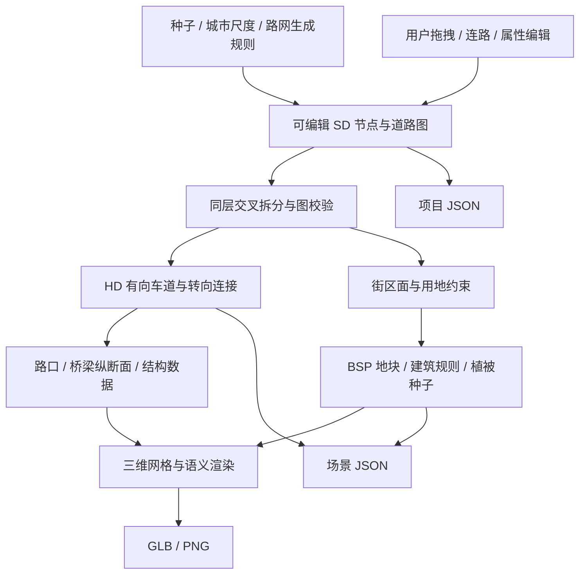

# 自顶向下的程序化城市

持久化数据是用户意图和种子。派生层不反向覆盖 SD，渲染器不决定道路连通性。

## 数据契约

| 层 | 模块 | 持有的数据 | 不应持有的数据 |
| --- | --- | --- | --- |
| SD | `src/sd-map.js` | 节点 ID、坐标、道路端点、道路等级、双向车道数、交叉层级、生成种子 | 标线顶点、材质、逐车道连接 |
| 路网生长 | `src/urban-growth.js` | 河流、保护区、城区中心、方向场、人口密度与局部接入约束 | 固定行列网格 |
| HD | `src/hd-map.js` | 有向车道中心线、宽度、连接器、前驱/后继、路口端口与边界 | UI 状态、THREE 对象 |
| 设施 | `src/hd-map.js`、`src/corridor.js` | 桥梁纵断面、厚度、支撑、设施类别与道路引用 | 生成后才猜测的连通关系 |
| 城市 | `src/city.js` | 图的有界面、退界、地块、建筑轮廓、楼层和对象种子 | 脱离路网的随机建筑坐标 |
| 渲染 | `src/city-render.js` | 几何合批、程序材质、建筑立面和树叶几何、类别显示 | 改写 SD 或 HD 的道路规则 |

坐标使用米，Y 向上，北方为 -Z。SD `from/to` 定义道路参考方向；`lanesForward` 沿该方向行驶，`lanesBackward` 反向行驶。HD 的 `path` 始终按行驶方向排列，`successors/predecessors` 引用 lane ID，连接器另存具体曲线。

`layer=0` 的相交线段拆分为共享节点。`layer=1/-1` 的中段交叉分别表示上跨/下穿意图，不因平面相交而产生连接。道路端点仍以明确的节点 ID 连接，桥梁引道回到端点高程。层级是拓扑意图，不能直接当作固定高程。

项目 JSON v4 保存 SD 与参数，旧版局部路口项目可继续加载。场景 JSON v1 保存实际派生的道路横断面、HD、设施、桥墩、街区、地块、建筑、树种子与语义颜色字典。它不等同于第三方地图格式。

## 当前算法和约束

SD 生成器采用分阶段生长。先生成河流、保护区和不同密度的城区中心，再铺设河岸干路、有限的跨河通道和带环形街道的旧城核心；支路随后按优先级队列生长。四重方向场混合局部街道朝向、旧城径向和河岸切线，方向随位置变化，步长随人口密度变化。道路接近已有路网时吸附为真实节点或终止，局部约束排除水域、保护区、近距平行路和过小接入角。吸附后再次检测改向后的线段，避免意外产生短边。

这套实现参考了 [Chen 等人的方向场街道建模](https://www.cs.drexel.edu/~david/Classes/Papers/a103-chen.pdf) 和 [Parish / Müller 的全局目标与局部约束分离](https://people.eecs.berkeley.edu/~sequin/CS285/PAPERS/Parish_Muller01.pdf)，并非论文算法的完整复现。当前提供河谷城市基线，尚无连续地形寻路、历史增长仿真或多种区域风格的综合评测。

回归检查包含 36 组种子/尺度组合、同层连通、短边、水域避让以及街道方向分布。四重方向集中度可检出任意旋转的正交网格，但它只是几何退化检测，不等同于城市真实感评分。

路口由入射道路计算截断半径、端口和转角曲线。HD 先按横断面生成双向车道，再按可行转向分配连接。连接器的端点严格来自车道端点；同层交叉拆点和前驱/后继引用有回归测试。当前没有信号相位、车辆包络或交通容量求解。

桥梁采用五次平滑纵断面，接地处坡度平滑过渡。结构层根据下穿道路的位置安排高程平台，桥墩位置避开其他道路的全宽。用户编辑可能导致引道过短，此时报告实际纵坡；不会假装已经满足全部工程约束。下穿目前输出纵断面和 HD 数据，HD 规划投影可查看地下车道；隧道洞口、围护结构和地形开口仍待实现。

街区使用半边遍历提取有界面。半平面侵蚀生成保守退界，BSP 细分地块，缺乏临街关系的地块作为绿地；建筑还避开高架走廊。非凸面目前只使用内侧半平面的交集，可能留下未填充区域。建筑高度取决于多中心距离和地块种子，修改密度不会改变道路或其他保留建筑的种子。

渲染层按材质和类别合批。建筑外墙窗格纹理由代码生成，树干、分枝和单叶几何来自每棵树的种子。当前使用有限规则和细节等级，没有宣称照片级保真、树种多样性或 SOTA。

## 后续扩展顺序

1. **扩充 SD 生成器与评测**：保持同一数据契约，在当前方向场、密度场与河流约束上引入连续地形代价和多个地理/历史风格；衡量连通性、道路等级比例、街区形状和生成成本。
2. **HD 几何约束**：曲线道路、渐变段、禁止转向、车道增减、转弯包络、曲率及坡度约束；建立局部增量派生和空间索引。
3. **设施子图规则**：根据道路等级、交叉关系、转向需求与空间预算选择平交、环岛或立交。立交需要真实匝道边和分合流节点，不能仅靠两条道路上下叠放。保留的局部路口模块可在这个阶段接入规则库。
4. **空间与微观层次**：地形开挖、桥隧结构、建筑语法、室内、植物生长与 LOD；对象 ID、子种子和语义从城市逐级传递至构件。
5. **应用适配**：独立增加物理、交通、传感器、卫星观测与数据集导出器；按目标域验证，避免将静态场景生成等同于完整世界仿真。

JavaScript 数据层保持纯计算，未来可以通过 Worker、Rust/WASM 或离线工具替换实现。是否迁移由可复现的性能与规模测量决定，SD/HD 契约和编辑器无需随内核语言重写。
