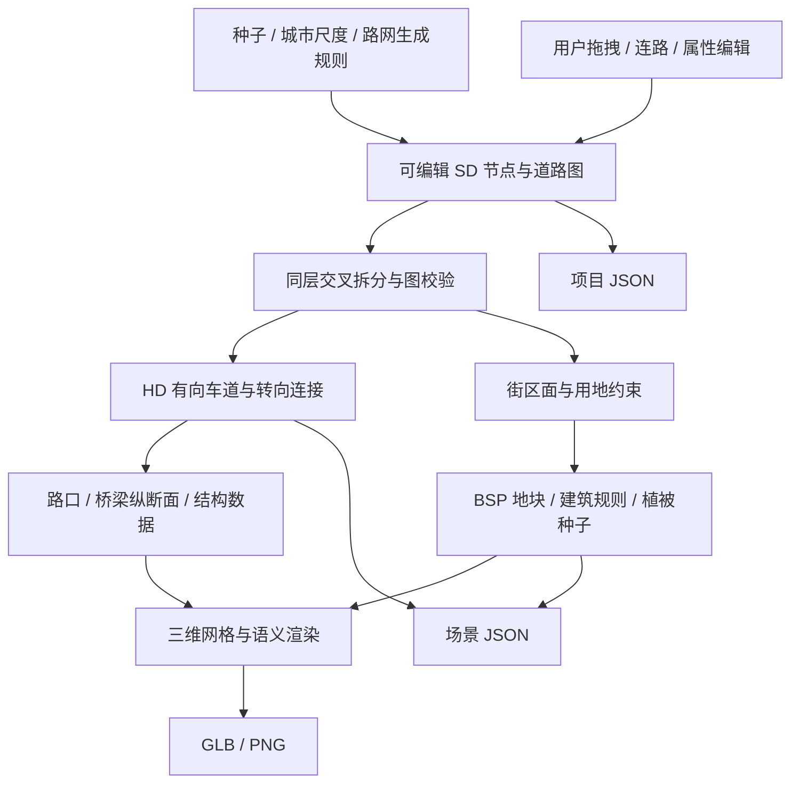

# 自顶向下的程序化城市

持久化数据是用户意图和种子。派生层不反向覆盖 SD，渲染器不决定道路连通性。

## 数据契约

| 层 | 模块 | 持有的数据 | 不应持有的数据 |
| --- | --- | --- | --- |
| SD | `src/sd-map.js` | 节点 ID、坐标、道路端点、道路等级、双向车道数、交叉层级、生成种子 | 标线顶点、材质、逐车道连接 |
| 路网生长 | `src/urban-growth.js` | 河流、城区中心、密度场、分级方格（主干/次干/支路）、对角街、环城路与桥位 | 逐街区手绘路网 |
| HD | `src/hd-map.js` | 有向车道中心线、宽度、连接器、前驱/后继、路口端口与边界 | UI 状态、THREE 对象 |
| 设施 | `src/hd-map.js`、`src/corridor.js` | 桥梁纵断面、厚度、支撑、设施类别与道路引用 | 生成后才猜测的连通关系 |
| 城市 | `src/city.js` | 图的有界面、退界、地块、建筑轮廓、楼层和对象种子 | 脱离路网的随机建筑坐标 |
| 渲染 | `src/city-render.js` | 几何合批、程序材质、建筑立面和树叶几何、类别显示 | 改写 SD 或 HD 的道路规则 |

坐标使用米，Y 向上，北方为 -Z。SD `from/to` 定义道路参考方向；`lanesForward` 沿该方向行驶，`lanesBackward` 反向行驶。HD 的 `path` 始终按行驶方向排列，`successors/predecessors` 引用 lane ID，连接器另存具体曲线。

`layer=0` 的相交线段拆分为共享节点。`layer=1/-1` 的中段交叉分别表示上跨/下穿意图，不因平面相交而产生连接。道路端点仍以明确的节点 ID 连接，桥梁引道回到端点高程。层级是拓扑意图，不能直接当作固定高程。

项目 JSON v4 保存 SD 与参数，旧版局部路口项目可继续加载。场景 JSON v1 保存实际派生的道路横断面、HD、设施、桥墩、街区、地块、建筑、树种子与语义颜色字典。它不等同于第三方地图格式。

## 当前算法和约束

SD 生成器（`grid-city-v3`）按"典型中国城市"的层级网络构造：先定河流与密度中心，再铺三层正交方格——主干路（间距约 5.5 倍街区）、次干路（约 2.4 倍）、支路（街区块尺度）——按人口密度逐线门控（老城密、外围疏），旧城核心叠加 ±45° 对角街，外围套 16 边形环城路；跨河只保留主河道上少量桥梁，桥面 `layer=1`、两岸留约百米滨河绿带。河曲可能在环城路顶点附近进出绿带多次，只有跨主河道的那一段算桥，避免短桥段把纵坡顶到 6% 上限。

所有线两两求交切边后按 `MIN_EDGE` 半径做邻域合并（合并到加权簇心，而不是吸附到先到的切点，否则整条街在路口被拧出斜角），再迭代拆交叉、收缩短边，保证平面图没有 12m 以下碎边；被公园或河道切断的孤立小分量会剪掉，最终只保留最大连通分量。

回归检查包含 36 组种子/尺度组合、同层连通、短边、水域避让、四向交叉占比（>0.4）与街区面积比（p80/p20>1.6）。邻域合并会给极少数环城路顶点带来 15-20° 斜交，测试允许每张图最多 2 处此类告警，其余错误/告警必须为零。

路口由入射道路计算截断半径、端口和转角曲线。HD 先按横断面生成双向车道，再按可行转向分配连接。连接器的端点严格来自车道端点；同层交叉拆点和前驱/后继引用有回归测试。当前没有信号相位、车辆包络或交通容量求解。

桥梁采用五次平滑纵断面，接地处坡度平滑过渡。结构层根据下穿道路的位置安排高程平台，桥墩位置避开其他道路的全宽。用户编辑可能导致引道过短，此时报告实际纵坡；不会假装已经满足全部工程约束。下穿目前输出纵断面和 HD 数据，HD 规划投影可查看地下车道；隧道洞口、围护结构和地形开口仍待实现。

街区使用半边遍历提取有界面。半平面侵蚀生成保守退界，BSP 细分地块，缺乏临街关系的地块作为绿地；建筑还避开高架走廊。非凸面目前只使用内侧半平面的交集，可能留下未填充区域。建筑高度取决于多中心距离和地块种子，修改密度不会改变道路或其他保留建筑的种子。

渲染层按材质和类别合批。建筑外墙窗格纹理由代码生成，树干、分枝和单叶几何来自每棵树的种子。当前使用有限规则和细节等级，没有宣称照片级保真、树种多样性或 SOTA。

### 写实街道层（scene 视图）

以"数字孪生街景"为基准补齐的可信度要素，全部程序化、确定性（种子驱动），并在无 DOM 的测试环境降级为纯色材质：

- **天空与光照**（`sky.js`）：跟随相机的天空穹顶 shader——天顶/地平线渐变、太阳圆盘与光晕、两层域扭曲 FBM 积云（慢速漂移）。穹顶同时烘焙为 PMREM 环境贴图，玻璃幕墙、水面与沥青反射真实天空；太阳方向 `SUN_DIR` 全场景固定，天空、IBL 与阴影永远一致。雾色与穹顶地平线匹配。
- **后处理**：HDR 渲染目标（4× MSAA）→ GTAO 环境光遮蔽 → 轻微 bloom → OutputPass 统一 ACES 色调映射与 sRGB。AO 是"物体不悬浮"的地基：建筑根部、路缘、树干和车辆接触处都靠它落地。GTAO 的法向/深度 G-buffer 是统一材质重绘的——alpha 裁剪的叶簇卡会被当成实心四边形把树冠自遮挡成黑团，因此给 `gtaoPass.normalMaterial` 打了补丁：只对带 `aLeafCard` 标记的顶点按叶簇贴图 alpha 丢弃片段。SD/HD/语义等示意图视图保持直渲染，纯色 overlay 不被 AO/bloom 弄脏。
- **地面材质**（`proceduralMaterial`）：沥青/铺装/草地都是 256px 程序纹理并附带由高度场生成的法线贴图（骨料颗粒、勾缝凹槽、草簇在斜射光下有立体感）。UV 为世界坐标（4m 一格），各向异性 16。铺装是 0.5×0.25m 错缝砖；沥青是多尺度斑块+骨料；城市外草地再在片元里按世界坐标叠一层公里级色斑/枯黄变化（`onBeforeCompile`，不增加 draw call）。
- **街道设施**（`city-render.js`）：电线杆（横担+变压器，路段内等距、跨路口就近连线）与悬链线线缆（抛物线垂度、正交薄片）；蓝色导向牌/行人过街标志（canvas 纹理，无 DOM 时纯色兜底）；主干路人行道金属护栏；路口环形护柱（`distanceToRoad` 过滤道路开口）；中央分隔带灌木球绿篱（flatShading 低多边形团块 + 色彩/尺寸抖动）；公园/绿地的 alpha 裁剪草丛；信号灯遮阳檐；水面低粗糙度金属反光。
- **人行道连续性**：路口箱体保持沥青,铺装只存在于转角区与道路两侧。转角补丁内沿 = 路口圆角曲线(人行道高程),外沿 = 从下一个开口人行道端点到上一个开口端点的二次曲线、中段外弓 3m 并按 sin 弧沉到地块面以下——外弓量盖过"圆角曲线凹得深、街区倒角是直线"之间的楔形,沉落使其塞进街区面之下,铺装从人行道经转角一直连到建筑地块,不留裸地。`hd-map.js` 的 walkRing 端口处垂直外推、转角处径向外推,只作护柱线使用(曾试过让外圈重新拟合三次曲线,控制点垂度按外圈跨度放大后翻进路口箱体,是"铺装铺满路口"与"转角漏缝"两个病症的共同根源,已废弃)。
- **树木**：树干与分枝手工数组生成，树冠是 **alpha 裁剪的叶簇卡片云**（每枝 22-31 张随机朝向的卡，单卡 0.8-1.6m，贴图一格里几十片叶子，顶点色控制色相/冠内明暗）。相比"上千片三角形小叶"路径顶点少一个数量级且远看成连续树冠；卡片法向混向天顶模拟叶片透光散射，否则背光的一半叶片会黑掉。行道树覆盖所有地面道路（支路单侧 30m、干路双侧 15m），总量上限 2600。
- **建筑首层**：所有非坡顶建筑的 0-3.2m 是独立的首层贴图（商铺石材基座+橱窗+招牌带 / 写字楼通高玻璃+石柱 / 住宅门窗+台阶，按风格选择），水平按 4.2m 重复、纵向不平铺；标准层从 3.2m 起算。街景真实感的大头在首层，没有它楼群就是方盒。
- **店招**（`signMaterials`）：沿街商铺楼在首层顶部（3.3-4.2m）加一条连续的实体招牌板，每 4m 一块、12 种底色/中文店名轮换、四分之一概率空缺，像真实商业街的店招带；无 DOM 的测试环境退化为纯色板，不依赖字体资源。
- **街区铺装**:地块面抬到与人行道同一基准(路床 0.32 - 路缘 0.15),建筑地块整面铺砖、绿地铺草,block 外沿裙墙落到地面;街区退线与路缘齐平(margin 0),建筑与人行道之间无裸土断层。转角补丁外沿按 sin 弧沉到地块面以下,衔接处不悬空。
- **路网平滑**(`simplifySDMap`):有机生长每步随机转折,连续浅折角把街道切碎、每个折点还派生独立的路口箱体(截断、标线断缝、人行道环带)。生成后把折角 <14° 的度 2 延续节点合并成一条直路(通行能力按路径方向取大、等级取高);生长的方向场转折幅度同步减半;度 2 节点的截断半径收紧到 min(width×0.5+2, 8),弯道不再挖出大块路口箱体。
- **建筑多样性**：24 种立面 tile 按风格分组；单张纹理纵向覆盖 4 个楼层,逐层窗型/明暗独立（矮窗/通高窗/带形窗）+ 幕墙竖向窗棂；逐栋明度/色相顶点色抖动 + 15% 概率 U 镜像；玻璃楼逐层深色层间带、住宅逐层阳台板（三种共享色调按变体选择）；floors>22 的塔楼做顶部退台冠层；屋顶水箱/设备/天线。
- **性能契约**：树每棵只产出木/叶两个几何体（枝干手工数组生成），树冠卡片按材质合批；写实层目标是单次 scene 渲染保持一个合批数量级（<50 draw），城市管线四个投影的集成测试超时相应放宽到 20s。
- **可视化回归**：`e2e/street.spec.js` 从 SD 路网推导五个确定性机位（主路车道、人行道、路口、街边店面、鸟瞰），经 `window.__studio.placeCamera` 摆好相机后把画布截图到 `artifacts/realism/`。改动渲染前先看这组图，是"照片感"迭代的标尺。

已知边界：没有行人/背景车流动画、没有 LOD 与流式加载、云层是解析近似而非体积光照。

## 后续扩展顺序

1. **扩充 SD 生成器与评测**：保持同一数据契约，在当前方向场、密度场与河流约束上引入连续地形代价和多个地理/历史风格；衡量连通性、道路等级比例、街区形状和生成成本。
2. **HD 几何约束**：曲线道路、渐变段、禁止转向、车道增减、转弯包络、曲率及坡度约束；建立局部增量派生和空间索引。
3. **设施子图规则**：根据道路等级、交叉关系、转向需求与空间预算选择平交、环岛或立交。立交需要真实匝道边和分合流节点，不能仅靠两条道路上下叠放。保留的局部路口模块可在这个阶段接入规则库。
4. **空间与微观层次**：地形开挖、桥隧结构、建筑语法、室内、植物生长与 LOD；对象 ID、子种子和语义从城市逐级传递至构件。
5. **应用适配**：独立增加物理、交通、传感器、卫星观测与数据集导出器；按目标域验证，避免将静态场景生成等同于完整世界仿真。

JavaScript 数据层保持纯计算，未来可以通过 Worker、Rust/WASM 或离线工具替换实现。是否迁移由可复现的性能与规模测量决定，SD/HD 契约和编辑器无需随内核语言重写。

## 路口逻辑统一内核（进行中）

项目存在两条管线：独立路口编辑器（`road-model → lane-topology → lane-derive → render`）与城市模式（`sd-map → hd-map → city-render`）。两者的路口逻辑历史上是两套实现。统一原则：**独立路口编辑器继续维护，路口逻辑收敛到同一内核，禁止新增长出第二套**。

第一步已完成：`src/junction-spec.js` 作为 GB 5768.3 / GB 50647 路口设计规格的唯一事实来源（黄线 15cm、停止线 35cm、横道条宽 45cm/间距 60cm/深度 4m、导向车道实线段 30m、导向箭头长 5m 距切边 13m、待转区伸入 11m、中央分隔带宽度、拓宽渐变段 58m）。`hd-map.js`、`city-render.js`、`lane-derive.js` 已改为从该模块取值；任何一侧不得再写局部字面量。

信号相位已先行统一：`ego.js` 的 `signalPhase`（16s 周期：NS 绿 0-6s、黄 6-7s、EW 绿 8-14s、黄 14-15s、清空各 1s）是信号灯渲染、自车与未来背景车流的共同时钟。`routePlan` 输出每个路口的停止线站点与进口轴；自车据此在红灯前停车、黄灯按制动距离决定通过或停止、绿灯放行，`main.js` 不再自带一套相位字面量。

后续收敛顺序：

1. **共享路口内核**：以"进口道描述（航向角 + 进/出车道数 + 中央分隔带）→ 派生路口场景（停止线/横道/导向实线/箭头/待转区/连接线/相位）"为唯一函数签名。独立编辑器的 arm 与城市的节点端口都归一为该描述，`frame.js` 的直线射线内核作为几何基础。
2. **HD 数据对齐**：城市路口的连接器沿用独立编辑器的转向分类与待转区/右转设施推导（`road-movements.js` 已是共享的单一事实来源）；独立编辑器反过来复用城市的连接线 fillet 算法。
3. **渲染合流**：`city-render.js` 的路口标线绘制函数迁入共享内核，`render.js` 只保留材质与合批。
